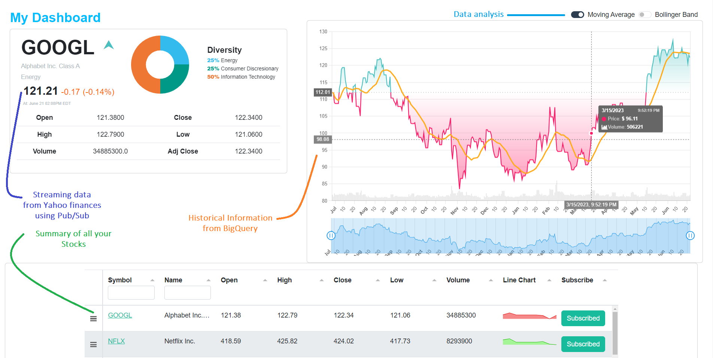
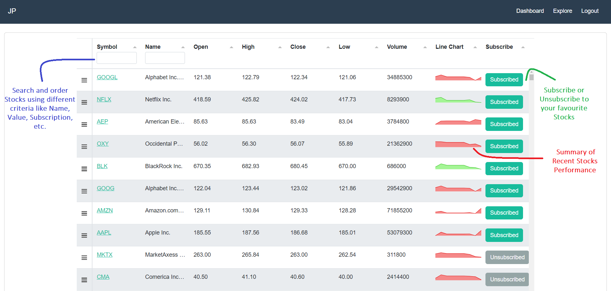
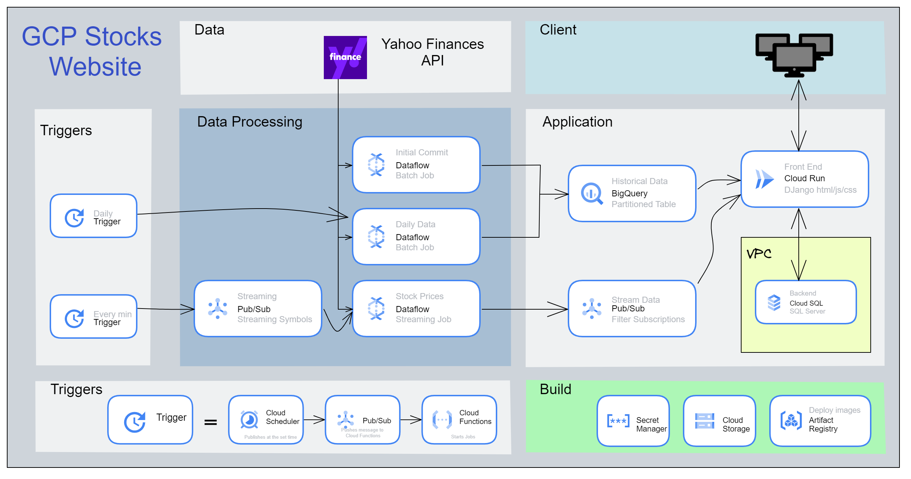

# Google Cloud Stock Market

This project deploys a Django Website creating every dependency in Google Cloud Platform.   

The website streams current Stocks information of S&P500 companies and presents it in a customizable dashboard.

## Requirements

**Note**: Creating some dependencies in Google Cloud will incur a cost to your billing account. 

The project requires you to have a **Google Cloud Platform account**, an active **Google Cloud billing account** and the permissions necessary to link a new project to this account.

To create dependencies the project uses the **google cloud CLI** to create all dependencies, please install it following [these](https://cloud.google.com/sdk/docs/install) instructions.

Also **install** the following extra components, in the Google CLI 

```bash
gcloud components install gsutil
gcloud components install beta
gcloud components install bq
gcloud components install gcloud-crc32c
```

## Usage

Before running the script you need to **update** the file **variables.txt** locally with your information. 

```
PROJECT_ID=<A Unique Project ID>
NAME=<The Name of the Project>
BILLING_ACCOUNT=<Your Billing Account>
DJPASSWORD=<The Password for the SQL Server Database>
REGION=us-central1
DFLOW_TOPIC=Data_flow
DBUG=TRUE
VPC-CONNECTOR-NAME=sql-server-connector
INSTANCE_NAME=cloudsqlfordj
SQL_DATA_FILE=../local_data/SP500_stocks_info.csv
```
Enter the folder **dependencies** and run the following command

```bash
Deploy_project.cmd
```
At the end of the script, you will have a cloud-run application that hosts a website to analyze stocks. This is the end result





## Dependencies
After running the script you get the following architecture


You will create a new project with name PROJECT_ID and name NAME that contains:
* 1 GCS bucket called PROJECT_ID-media to store static files
* 1 GCS bucket called PROJECT_ID-dataflow to store dataflow related files
* 4 Pub/Sub topics to trigger Dataflow jobs and stream data
* 1 BigQuery Database and Table to host historical information
* 1 VPC Connection for the SQL SERVER called VPC-CONNECTOR-NAME
* 1 Cloud SQL SERVER Instance with name INSTANCE_NAME with root user's password DJPASSWORD to store users' information.
* 1 Secret called application_settings. 
* 2 batch DFLOW templates inside PROJECT_ID-dataflow one to get historical stock data for the first time in the BigQuery Table, one to update the BigQuery table daily.
* 1 streaming DFLOW template inside PROJECT_ID-dataflow to stream stocks data.
* 1 migration job to migrate data to the SQL Server instance and to migrate static files to GCS 
* The appropriate service accounts and permissions to run the application

It will also deploy inside the new project:

* 2 cloud functions one to trigger the dataflow job that updates the BigQuery Table daily and one to trigger the dataflow job to stream data. 
* 1 cloud scheduler job to trigger a cloud function to update BigQuery daily. 
* 1 cloud scheduler job to trigger a cloud function to stream stocks symbols to Pub/Sub which sends them to Dataflow.  
* 1 cloud run application called stocks-website with image name myfullimage saved in artifact. 

